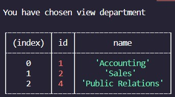

# Employee Tracker

## Description
A command line program that lets you add, view, and delete sql tables to handle departments, roles, and employees in a database.

## User Story
AS A business owner
I WANT to be able to handle a business database
SO THAT I can easily see the function parts of the office

## USAGE
To use, run node in the index.js file. 

```
HOT TIP:Before running, make sure the npm packages inquirer and mysql are installed. Add a root.js file with the mysql data needed. Run the workDB.sql file in Workbench to get the database seeded.
```

## Links
[Github Repo](https://github.com/najuasaad/employeetracker)

[Walkthrough Video](https://drive.google.com/file/d/1FLokr3I2flZQpo_vvsbMg0WkGGn7o9zw/view)

## Screenshots
A table view of the departments in the console:



A table view of the roles in the console:


A table view of the employees in the console:


